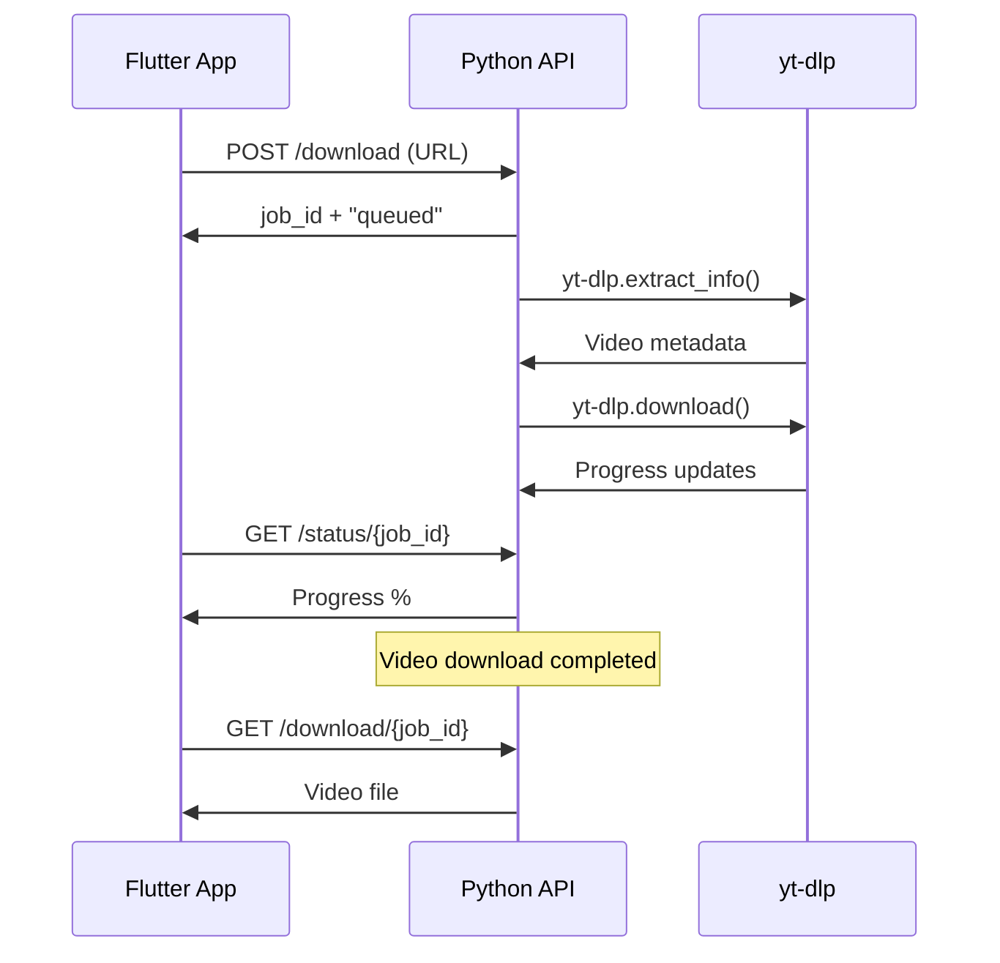

# 🎬 Linkcim - Python API Entegre Video İndirme Sistemi

## 📋 Genel Bakış

Bu sistem, Flutter ile Python API'sinin entegre çalışmasını sağlar. Python'un güçlü video indirme kütüphaneleri (yt-dlp) sayesinde:

- ✅ YouTube, Instagram, TikTok, X/Twitter, Facebook videolarını indirir
- ✅ Yüksek kaliteli video/ses indirme
- ✅ Real-time progress tracking
- ✅ Thumbnail ve metadata desteği
- ✅ Otomatik platform algılama

## 🚀 Hızlı Başlangıç

### 1. Python API'sini Başlatın

```bash
# Proje klasöründe Python API'sini başlatın
python start_api.py
```

Bu komut:
- Gerekli Python paketlerini yükler
- API'yi localhost:8000'de başlatır
- Downloads klasörünü oluşturur

### 2. Flutter Uygulamasını Başlatın

```bash
# Başka bir terminal'de Flutter uygulamasını başlatın
flutter run
```

## 📱 Sistem Mimarisi

```
┌─────────────────┐    HTTP API     ┌─────────────────┐
│                 │ ────────────►   │                 │
│ Flutter App     │                 │ Python API      │
│                 │ ◄────────────   │ (yt-dlp + FastAPI) │
└─────────────────┘    JSON Data    └─────────────────┘
                                           │
                                           ▼
                                    ┌─────────────────┐
                                    │ Downloads Folder│
                                    │ (Video Files)   │
                                    └─────────────────┘
```

## 🔧 Kurulum Detayları

### Gereksinimler

- **Python 3.8+**
- **Flutter 3.0+**
- **Internet bağlantısı**

### Python Bağımlılıkları

```
fastapi==0.104.1
uvicorn[standard]==0.24.0
yt-dlp==2023.11.16
python-multipart==0.0.6
aiofiles==23.2.1
httpx==0.25.2
requests==2.31.0
pydantic==2.5.0
```

### Flutter Bağımlılıkları

Mevcut `pubspec.yaml` dosyasındaki paketler yeterli.

## 📊 API Endpoints

### 🚀 Video İndirme
```http
POST /download
Authorization: Bearer {API_KEY}
Content-Type: application/json

{
  "url": "https://youtube.com/watch?v=...",
  "format": "mp4",
  "quality": "medium",
  "platform": "youtube"
}
```

### 📈 İndirme Durumu
```http
GET /status/{job_id}
Authorization: Bearer {API_KEY}
```

### 📥 Dosya İndirme
```http
GET /download/{job_id}
Authorization: Bearer {API_KEY}
```

### 🌐 Platform Listesi
```http
GET /platforms
Authorization: Bearer {API_KEY}
```

## 🎯 Desteklenen Platformlar

| Platform | Video | Audio | Özellikler |
|----------|-------|-------|------------|
| **YouTube** | ✅ | ✅ | Playlists, Thumbnails, Metadata |
| **Instagram** | ✅ | ❌ | Stories, Reels, Posts |
| **TikTok** | ✅ | ❌ | No-watermark, Metadata |
| **Twitter/X** | ✅ | ❌ | Multiple videos |
| **Facebook** | ✅ | ❌ | Posts, Stories |

## 🔄 İndirme Akışı



## 🛠️ Geliştirici Notları

### Video Download Service Değişiklikleri

Yeni `VideoDownloadService` şu özellikleri sunar:

- **Python API entegrasyonu**: HTTP istekleri ile video indirme
- **Real-time progress**: İndirme ilerlemesini takip etme
- **Platform otomatik algılama**: URL'den platform tespiti
- **Hata yönetimi**: Detaylı hata raporlama
- **Dosya yönetimi**: Otomatik dosya isimlendirme

### API Güvenliği

```dart
static const String _apiKey = '45541d717524a99df5f994bb9f6cbce825269852be079594b8e35f7752d6f1bd';
```

⚠️ **Üretim ortamında bu API anahtarını değiştirin!**

### Konfigürasyon

```dart
// lib/services/video_download_service.dart
static const String _baseUrl = 'http://localhost:8000'; // API URL'si
static const int _timeoutSeconds = 120; // Timeout süresi
static const int _pollIntervalMs = 2000; // Durum kontrol aralığı
```

## 🐛 Hata Giderme

### Python API Başlatılamıyor

```bash
# Port 8000 kullanımda olabilir
netstat -an | findstr :8000

# Farklı port kullanın
python -m uvicorn api:app --host 0.0.0.0 --port 8001
```

### Flutter'da API Bağlantısı Yok

1. Python API'sinin çalıştığını kontrol edin: http://localhost:8000/health
2. Firewall ayarlarını kontrol edin
3. API URL'sini doğrulayın

### Video İndirme Başarısız

1. URL'nin geçerli olduğunu kontrol edin
2. Platform desteğini kontrol edin
3. Internet bağlantısını kontrol edin
4. API log'larını inceleyin

## 📝 Güncellemeler

### v2.0.0 - Python API Entegrasyonu
- ✅ Python yt-dlp entegrasyonu
- ✅ Real-time progress tracking
- ✅ Multi-platform support
- ✅ Improved error handling
- ✅ Background downloading

